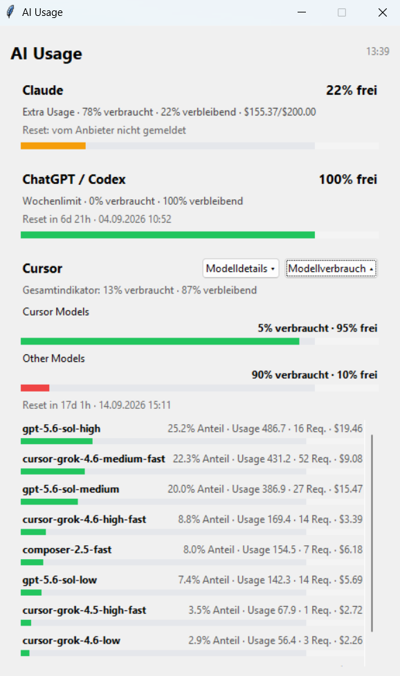
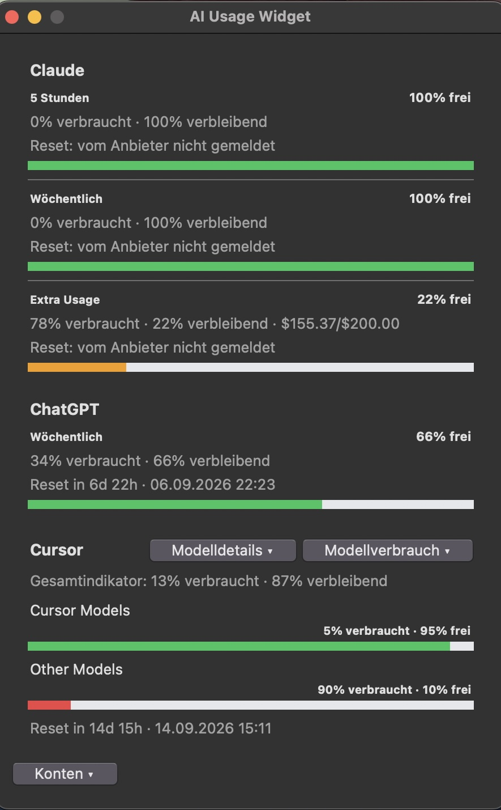
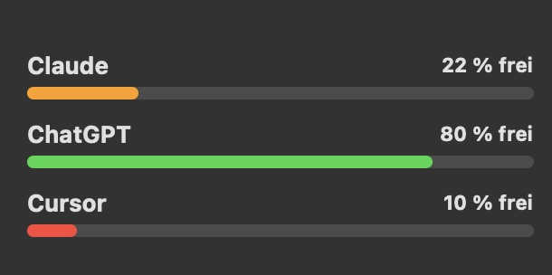

# AI Usage Widget


A compact Windows system-tray app and native macOS app with a WidgetKit desktop widget for monitoring AI subscription and agent usage across:

- **Claude / Claude Code**
- **ChatGPT / Codex**
- **Cursor**
- **Cursor per-model usage breakdown**

The Windows app lives in the system tray. On macOS, the app behaves like a normal Dock application and can supply an optional desktop widget.

## Preview

<table>
  <tr>
    <th>Windows</th>
    <th>macOS</th>
  </tr>
  <tr>
    <td width="50%" align="center" valign="top">
      
    </td>
    <td width="50%" align="center" valign="top">
      <br><br>
      <strong>Widget (Xcode developer-only view)</strong><br>
      
    </td>
  </tr>
</table>

## Features

- Remaining and consumed usage shown together
- Reset countdown and reset date when the provider exposes it
- Claude Extra Usage support
- ChatGPT / Codex weekly or 5-hour agent limit support
- Separate Cursor **Cursor Models** and **Other Models** pools
- Expandable Cursor model table with requests, weighted usage and costs
- Expandable **Model consumption** view with one bar per Cursor model
- `AI` system-tray icon on Windows
- Native Dock application and WidgetKit widget on macOS
- Manual refresh and 5-minute auto-refresh
- Optional always-on-top mode
- No API keys need to be pasted into the app

## Platform support

- **Windows 10/11:** stable
- **macOS 14 Sonoma, macOS 15 Sequoia, and macOS 26 Tahoe:** native app bundle and WidgetKit extension built locally by the installer

The established Windows entry point remains unchanged. macOS has a separate native build entry point so its Dock, WidgetKit, Keychain, and Claude Desktop integrations do not change Windows behavior.

## Installation overview

The platform versions and their detailed guides are kept separate:

| Version | Xcode required | Detailed guide |
| --- | --- | --- |
| Windows | No | [`platforms/windows`](platforms/windows/README.md) |
| macOS app | No | [`platforms/macos-app`](platforms/macos-app/README.md) |
| macOS app + desktop widget | Yes | [`platforms/macos-widget-developer`](platforms/macos-widget-developer/README.md) |

## Windows installation — step by step

**Requirements:** Windows 10 or 11 and PowerShell. The app needs Python 3.10 or
newer, but in the normal installation you do not have to install Python first.
If Python is missing, `install.ps1` automatically installs Python 3.13 through
Windows Package Manager (`winget`). If `winget` is unavailable, install Python
manually from [python.org](https://www.python.org/downloads/windows/), reopen
PowerShell, and repeat the installation.

1. Download the repository with **Code > Download ZIP** and extract the ZIP, or
   clone the repository with Git.
2. Open the extracted **AI-Usage-Widget** folder in File Explorer.
3. Right-click an empty area in the folder and choose **Open in Terminal**, then
   make sure the terminal is using PowerShell.
4. Run these commands:

   ```powershell
   Set-ExecutionPolicy -Scope Process Bypass
   .\install.ps1
   ```

5. Wait until the installer reports that installation is complete.
6. Open the Windows Start menu, search for **AI Usage Widget**, and start it.
   The `AI` icon then appears in the system tray.

During these steps, the installer checks Python, installs missing Python through
`winget` where possible, installs the required Python packages, copies the app
to `%LOCALAPPDATA%\AIUsageWidget`, and creates the Start menu shortcut.

For a portable start without installation, double-click
`start_ai_usage_widget.bat` in the repository folder. Python and the packages
from `requirements.txt` must already be installed for this method.

---

## macOS installation — step by step (no Xcode)

A prebuilt, Developer ID-signed macOS download is not available yet. The normal
macOS app can nevertheless be built and installed locally without Xcode or an
Apple Developer membership. Only the optional right-side desktop widget needs
Xcode.

**Requirements:** macOS 14 or newer, Terminal, and Python 3.10 or newer with
Tkinter. The following instructions install Python and Tkinter through Homebrew.
If Homebrew is unavailable, install a current Python package with Tkinter from
[python.org](https://www.python.org/downloads/macos/) and skip step 3.

1. Download the repository with **Code > Download ZIP** and extract the ZIP, or
   clone the repository with Git.
2. Open Terminal, type `cd ` including the trailing space, drag the extracted
   repository folder into the Terminal window, and press Return.
3. Install Python and Tkinter:

   ```bash
   brew install python@3.14 python-tk@3.14
   ```

4. Build and install the normal macOS app:

   ```bash
   chmod +x scripts/macos/install.sh
   ./scripts/macos/install.sh --app-only
   ```

5. After the build finishes, **AI Usage Widget.app** is installed in
   `~/Applications`, registered with macOS, and opened automatically. You can
   reopen it through Finder, Spotlight, Launchpad, or the Dock.

This app-only version includes the Claude, ChatGPT, and Cursor status views,
manual refresh, and automatic refresh every five minutes. The only feature not
included is the optional WidgetKit desktop widget.

### Optional macOS desktop widget (Xcode developer-only view)

To add the right-side **AI Usage** desktop widget, install full Xcode, sign in
under **Xcode > Settings > Accounts**, and create an **Apple Development**
certificate. Then open Terminal in the repository folder and run:

```bash
./scripts/macos/install.sh --with-widget
```

After installation, use macOS **Edit Widgets**, search for **AI Usage**, and add
the small or medium widget. The AI Usage Widget app must remain running for new
usage snapshots every five minutes. If the app is closed, WidgetKit may continue
showing its most recent entry, but that value is no longer guaranteed to be
current.

Closing the macOS app window quits the app. Use **Keep in Dock** if you want its
icon to remain in the Dock while the app is closed.

## Data sources and required provider apps

AI Usage Widget does not create separate provider logins. A supported local app
or CLI must already be installed and signed in for each status you want to see:

| Status | Required local login |
| --- | --- |
| **Claude** | Claude Desktop or Claude Code. With Claude Desktop only, open Claude periodically so its local usage cache stays current. |
| **ChatGPT** | Codex desktop app or Codex CLI, which supplies `~/.codex/auth.json`. The ChatGPT desktop app by itself does not supply this Codex quota login. |
| **Cursor** | Cursor Desktop, signed in to the account whose usage should be displayed. |

The provider apps do not all need to remain open continuously. The **AI Usage
Widget app itself must remain running** for the optional desktop widget to
receive a new snapshot every five minutes.

## macOS compatibility

The macOS app has a deployment target of macOS 14.0 and uses APIs available on
Sonoma, Sequoia, and Tahoe. The app-only build works without an Apple developer
identity. When the optional widget is built, the installer derives unique host
and widget bundle identifiers from that user's Apple Development Team, so a
public clone does not depend on the repository owner's signing identity.

The current source has been validated on macOS 15.7.9 with Xcode 26.3, compiled
successfully against the macOS 26.2 Tahoe SDK, and is tested by CI on both macOS
and Windows. Python is needed only for the source build; Xcode and an Apple
Development certificate are required only for WidgetKit.

## Requirements

- Windows 10/11 or macOS 14+
- Python 3.10+
- Full Xcode and an Apple Development certificate only for the optional macOS WidgetKit build
- A supported, signed-in local provider app or CLI as listed above

### Claude

On macOS, the app first uses the existing Claude Code OAuth credentials from the
macOS Keychain. If Claude Code is not installed, it can fall back to the current,
non-sensitive usage cache written by the signed-in Claude Desktop app.

Typical location:

```text
%USERPROFILE%\.claude\.credentials.json
```

Claude Desktop-only users should open Claude Desktop periodically so its local
usage cache remains current. The app can show normal 5h/7d limits when exposed
by Anthropic. For accounts using **Extra Usage**, it displays used and remaining
budget. When Anthropic does not expose a reset timestamp, the widget says that
the provider did not report one instead of estimating a date.

### ChatGPT / Codex

The app reads the existing Codex login:

```text
%USERPROFILE%\.codex\auth.json
```

The displayed quota is the Codex / agent quota associated with the ChatGPT account. Normal ChatGPT conversations are not necessarily part of this quota.

### Cursor

The app reads Cursor's locally stored authenticated session and queries the Cursor dashboard endpoints.

It displays two separate pools:

- **Cursor Models**
- **Other Models**

It can additionally show an expandable per-model breakdown with:

- model name
- requests
- weighted Cursor usage
- observed costs

## About Cursor model percentages

The **Model consumption** percentages are the share of the model usage captured in the queried Cursor usage events. They are **not separate monthly limits for each model**.

For example:

```text
GPT model A      41% share
Claude model B   28% share
Gemini model C   17% share
```

means model A accounts for approximately 41% of the captured weighted usage.

## Privacy

AI Usage Widget does not ask you to paste API keys into the UI.

It reads the local authentication state already created by the installed provider tools and queries their usage endpoints. The macOS desktop-widget bridge exposes only usage percentages on `127.0.0.1`; it does not expose authentication tokens.

No telemetry is intentionally collected by this project.

## Important compatibility note

Some provider endpoints used for usage data—especially Cursor dashboard endpoints—are not stable public APIs. Providers can change them without notice.

If an upstream service changes its response format, a future widget update may be required.

## Uninstall

### Windows

From the cloned/downloaded repository:

```powershell
.\uninstall.ps1
```

### macOS

From the cloned/downloaded repository:

```bash
chmod +x scripts/macos/uninstall.sh
./scripts/macos/uninstall.sh
```

## Version

- Windows: **1.0.0**
- macOS: **1.1.4**

## License

MIT
